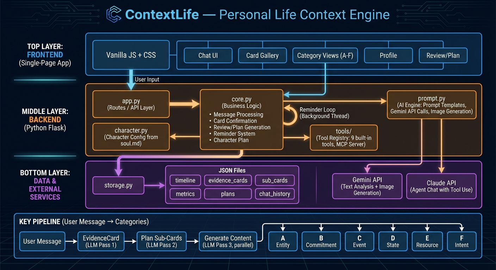

# ContextLife — Personal Life Context Engine

> **维护提示**：本文仍保留部分早期 ContextLife / A-F 卡片时代的系统说明。当前 Miru 产品定位、核心架构和路线图以 [PROPOSAL.md](./PROPOSAL.md) 为准；Claude Code / Codex 共享维护上下文见 [AI_MAINTAINER_CONTEXT.md](./AI_MAINTAINER_CONTEXT.md)。

> AI-powered life recording and structured management tool with a configurable virtual character assistant.
> Through natural language and image input, automatically extract entities, commitments, events, state metrics, resources, and intents — with daily review, planning, character schedule, and smart reminders.

## Architecture



### Multi-Platform and Sync

- Cross-platform shell (desktop + iOS + Android): see [multiplatform_sync_plan.md](multiplatform_sync_plan.md)
- BYODB sync schema draft: see [sync_schema.sql](sync_schema.sql)
- macOS run + full manual test flow: see [macos_run_and_full_test_flow.md](macos_run_and_full_test_flow.md)

---

## Table of Contents

- [Overview](#overview)
- [Tech Stack](#tech-stack)
- [File Structure](#file-structure)
- [Core Modules](#core-modules)
  - [1. Routes — app.py](#1-routes--apppy)
  - [2. Business Logic — core.py](#2-business-logic--corepy)
  - [3. AI Engine — prompt.py](#3-ai-engine--promptpy)
  - [4. Storage — storage.py](#4-storage--storagepy)
  - [5. Character System — character.py + soul.md](#5-character-system--characterpy--soulmd)
  - [6. Tool System — tools/](#6-tool-system--tools)
  - [7. Frontend — templates/index.html](#7-frontend--templatesindexhtml)
- [Data Model](#data-model)
  - [Six Major Categories (A–F)](#six-major-categories-af)
  - [Data Files](#data-files)
- [Core Pipeline](#core-pipeline)
  - [Message Processing: 3-Pass LLM Pipeline](#message-processing-3-pass-llm-pipeline)
  - [Card Lifecycle](#card-lifecycle)
  - [D-State Category Design](#d-state-category-design)
  - [Reminder System](#reminder-system)
- [API Reference](#api-reference)
- [Local Development](#local-development)
- [Deployment](#deployment)

---

## Overview

ContextLife is a **single-user life context management system**. Users record daily events in a chat-like interface, and AI (Claude) automatically transforms unstructured text into structured data across 6 major categories:

| Category | Name | Sub-categories | Description |
|----------|------|----------------|-------------|
| **A** | Entity | A1 Person, A2 Org, A3 Place, A4 Asset, A5 Account/Tool, A6 Relationship | People, organizations, places, things in your life |
| **B** | Commitment | B1 Strong Commitment, B2 Action Item, B3 Open Loop, B4 Recurring, B5 Blocker | Tasks, promises, deadlines, blocked items |
| **C** | Event | C1 Interaction, C2 Experience, C3 Transaction, C4 Health Event, C5 Decision, C6 Milestone | Things that happened |
| **D** | State | D1 Health Metrics, D2 Constraint, D3 Income, D4 Expense | Health data (daily aggregation), constraints, finance tracking |
| **E** | Resource | E1 Plan, E2 Knowledge, E3 Record, E4 Template, E5 Creative, E6 Collection | Reusable knowledge, notes, templates |
| **F** | Intent | F1 Goal, F2 Area, F3 Preference, F4 Principle, F5 Strategy | Long-term directions and values |

**Key Features:**
- **3-Pass LLM Pipeline**: Message → EvidenceCard → Plan Sub-Cards → Generate Content (parallel)
- **Daily aggregation**: D1 health metrics merge into one card per day
- **Finance tracking**: D3/D4 income/expense with balance calculation
- **Smart dedup**: Entity matching via search_tags, name, aliases
- **Daily Review & Plan**: Auto-generated at 23:30 or on-demand
- **Character System**: Configurable AI character via `soul.md` — personality, appearance, speech patterns
- **Smart Reminders**: Character-voiced push notifications with AI-generated illustrations
- **Agent Chat**: Claude-powered chat with 13 built-in tools via tool use

---

## Tech Stack

| Layer | Technology | Details |
|-------|-----------|---------|
| Frontend | Vanilla JS + CSS | Single-file SPA (~3600 lines), no framework |
| Backend | Python Flask | Route layer (app.py) + Business logic (core.py) |
| AI (Analysis) | Claude API (via proxy) | `claude-sonnet-4-5-20250929` for text & images |
| AI (Chat) | Claude API (anthropic SDK) | Claude Sonnet tool-use agent, up to 8 tool rounds |
| Tools | tools/ self-registering package | BaseTool + ToolRegistry auto-discover 13 tools + MCP Server |
| Storage | JSON files | Zero-dependency, no database, direct JSON read/write |
| Push | Web Push (VAPID) | Background browser notifications |
| Deploy | Local desktop | macOS / Windows / Linux, Tauri desktop pet |

---

## File Structure

```
ContextLife/
├── app.py                    # Flask route layer: HTTP routes, request validation
├── core.py                   # Business logic: message processing, card ops, review/plan/reminder
├── prompt.py                 # AI engine: system prompts, Claude API calls, image generation
├── storage.py                # Data layer: JSON CRUD, metrics, finance balance
├── character.py              # Character config loader: parses soul.md → CharacterConfig singleton
├── soul.md                   # Character definition (name, personality, appearance, references)
├── tools/                    # Self-registering tool package (BaseTool + ToolRegistry + MCP)
│   ├── __init__.py           #   ToolRegistry + auto_discover + get_registry singleton
│   ├── base.py               #   BaseTool abstract base class
│   ├── add_commitment.py     #   Write: create B1/B2 commitment
│   ├── complete_commitment.py#   Write: mark commitment completed
│   ├── update_schedule.py    #   Write: add/remove/modify schedule items
│   ├── generate_review.py    #   Write: trigger daily review generation
│   ├── generate_plan.py      #   Write: trigger tomorrow plan generation
│   ├── generate_character_plan.py # Write: trigger character plan generation
│   ├── query_sub_cards.py    #   Read: filter sub-cards by category/keyword/time/status
│   ├── search_timeline.py    #   Read: search timeline by keyword/date
│   ├── trace_evidence.py     #   Read: trace sub-card → evidence card source
│   ├── query_metrics.py      #   Read: health metric history
│   ├── query_today_events.py #   Read: today's recorded events
│   ├── query_schedule.py     #   Read: today's schedule
│   ├── mcp_server.py         #   MCP Server adapter (FastMCP, stdio/SSE)
│   └── mcp_proxy.py          #   MCPProxyTool: consume external MCP Server tools
├── mcp_config.json           # External MCP Server configuration
├── templates/
│   └── index.html            # Frontend SPA: HTML + CSS + JS
├── requirements.txt          # Python deps: flask, Pillow, pywebpush, anthropic, fastmcp
├── manifest.json             # PWA manifest
├── service-worker.js         # PWA Service Worker
└── data/                     # Runtime data (.gitignore excluded)
    ├── timeline.json         # Unified message timeline
    ├── evidence_cards.json   # EvidenceCards (LLM Pass 1 output)
    ├── sub_cards.json        # 6-category sub-cards (confirmed display units)
    ├── metrics.json          # D1 health metrics: {health: {date: {metric: {value, unit}}}}
    ├── chat_history.json     # Character chat history
    ├── daily_reviews.json    # Daily review archive
    ├── tomorrow_plan.json    # Current tomorrow plan (for reminder system)
    ├── tomorrow_plans.json   # Tomorrow plan archive
    ├── character_plan.json   # Current character plan (for scene context)
    ├── character_plans.json  # Character plan archive (7-day rolling)
    ├── daily_reminder_plan.json # Daily reminder schedule
    ├── reminders.json        # Reminder dedup tracking
    ├── push_subscriptions.json  # Web Push subscriptions
    └── uploads/              # User images + AI-generated reminder images
```

---

## Core Modules

### 1. Routes — app.py

Thin route layer. All business logic delegated to `core.py`.

**Startup sequence:**
```
app.py __main__
  ├── storage._ensure_dirs()
  ├── core.migrate_timestamps_utc_to_cst()    # one-time timezone fix
  ├── core.migrate_reminders_to_chat_history() # one-time migration
  ├── _start_reminder_loop(60s)                # background reminder thread
  └── app.run(host, port, debug)
```

### 2. Business Logic — core.py

All business logic lives here — no Flask dependency.

| Function | Description |
|----------|-------------|
| `save_message()` | Save message to timeline (no analysis) |
| `analyze_pending()` | Batch-analyze all pending messages |
| `process_message()` | Save + immediate analysis (legacy) |
| `confirm_card()` | Confirm card → persist sub-cards (D1 daily aggregation, D3/D4 finance, A-F dedup) |
| `reject_card()` / `edit_card()` | Reject or edit-confirm card |
| `retry_card()` / `refine_card()` | Re-analyze or dialogue-refine card |
| `generate_daily_review()` | Generate daily review |
| `generate_tomorrow_plan()` | Generate tomorrow plan |
| `generate_character_plan()` | Generate character daily schedule |
| `chat_with_airi()` | Character chat via Claude agent + 13 tools |
| `check_reminders()` | Check and fire reminders (called every 60s) |
| `check_auto_review_plan()` | Auto-generate review + plan + character plan at 23:30 |
| `migrate_to_evidence_cards()` | Full rebuild: re-process all timeline entries |

### 3. AI Engine — prompt.py

Manages all system prompts and API calls.

**Prompt Templates:**

| Prompt | Purpose |
|--------|---------|
| `EVIDENCE_CARD_SYSTEM_PROMPT` | Pass 1: Raw text → EvidenceCard (meta_messages, entities, tags) |
| `PLAN_SUB_CARDS_SYSTEM_PROMPT` | Pass 2: EvidenceCard → Plan (which sub-cards to create/update/complete) |
| `GENERATE_SUB_CARD_SYSTEM_PROMPT` | Pass 3: Plan item + meta_messages → Sub-card content |
| `DERIVE_SUB_CARDS_SYSTEM_PROMPT` | Fallback: EvidenceCard → Sub-cards (single-pass) |
| `DAILY_REVIEW_PROMPT` | Daily review generation |
| `TOMORROW_PLAN_PROMPT` | Tomorrow plan generation |
| `REFINE_CARD_PROMPT` | Dialogue-based card refinement |
| `_build_reminder_text_prompt()` | Character-voiced reminder text (dynamic character injection) |
| `_build_chat_system_prompt()` | Character chat (dynamic character + context injection) |
| `_build_character_plan_prompt()` | Character daily schedule generation |

**API Call Functions:**

| Function | Model | Purpose |
|----------|-------|---------|
| `call_evidence_card()` | VLM (Claude Sonnet) | Text/image → EvidenceCard |
| `call_evidence_card_batch()` | VLM (Claude Sonnet) | Multi-message batch → EvidenceCard |
| `call_plan_sub_cards()` | VLM (Claude Sonnet) | EvidenceCard → Sub-card plan |
| `call_generate_sub_card()` | VLM (Claude Sonnet) | Plan item → Sub-card content |
| `call_derive_sub_cards()` | VLM (Claude Sonnet) | EvidenceCard → Sub-cards (fallback) |
| `call_daily_review()` | VLM (Claude Sonnet) | Events + tasks → Review |
| `call_tomorrow_plan()` | VLM (Claude Sonnet) | Events + tasks → Plan |
| `call_character_plan()` | VLM (Claude Sonnet) | Date + history → Character schedule |
| `generate_reminder_text()` | VLM (Claude Sonnet) | Task info → Character reminder text |
| `generate_reminder_image()` | VLM (Claude Sonnet) | Task + reference image → AI illustration |
| `call_chat_agent()` | Claude Sonnet (anthropic SDK) | Multi-turn agent chat with tool use |

**API Mechanism:**
```
prompt.py
    ├── OpenAI SDK / Anthropic SDK → synai996.space (API proxy)
    ├── Auth: Bearer {AI_API_KEY}
    └── Response handling:
        ├── Text → strip markdown fences → json.loads()
        └── Image → base64 decode → image_bytes
```

### 4. Storage — storage.py

JSON file CRUD with helper functions for metrics and finance.

**Key Functions:**

| Function | Description |
|----------|-------------|
| `read_json()` / `write_json()` | Base JSON CRUD |
| `append_card()` / `get_card()` / `update_card()` | EvidenceCard CRUD |
| `save_sub_card()` / `update_sub_card()` | Sub-card CRUD |
| `find_entity_sub_card()` | Find entity by name (dedup) |
| `find_sub_card_by_search_tags()` | Fuzzy match by search_tags |
| `find_daily_health_sub_card(date)` | Find D1 health card for date (daily aggregation) |
| `get_finance_balance()` | Sum D3/D4 cards → {income, expense, balance} |
| `save_metrics_entry()` | Write health metric to metrics.json |
| `get_metrics_history()` | Get last N periods of metrics |
| `record_reminder()` | Record reminder + sync to timeline + chat_history |

### 5. Character System — character.py + soul.md

Fully decoupled character identity. Define a character in `soul.md`, all modules load via `get_config()`.

**soul.md structure:**
```markdown
# Identity
**Name**: Miru
**User Address**: Master

# Personality / Speech Patterns / Appearance / Backstory / Interests
(Character definition sections)

# Reference Images
**Avatar**: assets/brand/miru-avatar.png
**Reference**: airi_reference.webp
```

**CharacterConfig fields:** `name`, `user_address`, `personality`, `speech_patterns`, `appearance`, `avatar_filename`, `reference_filename`, `raw_text`

### 6. Tool System — tools/

Self-registering tool package. Each tool = BaseTool subclass with schema + execute.

**13 Built-in Tools:**

| Tool | Type | Description |
|------|------|-------------|
| `add_commitment` | write | Create B1/B2 commitment |
| `complete_commitment` | write | Mark commitment completed |
| `update_schedule` | write | Add/remove/modify schedule items |
| `generate_review` | write | Trigger daily review |
| `generate_plan` | write | Trigger tomorrow plan |
| `generate_character_plan` | write | Trigger character plan |
| `capture_screen` | read | Capture and analyze current screen content |
| `query_sub_cards` | read | Filter sub-cards by category/keyword/time/status |
| `search_timeline` | read | Search timeline by keyword/date |
| `trace_evidence` | read | Trace sub-card → evidence card source |
| `query_metrics` | read | Health metric history |
| `query_today_events` | read | Today's recorded events |
| `query_schedule` | read | Today's schedule |

**Auto-discovery:** `pkgutil.iter_modules()` scans `tools/`, finds all `BaseTool` subclasses, registers them.

**MCP Server:**
```bash
python -m tools.mcp_server          # stdio mode (Claude Desktop)
python -m tools.mcp_server --sse    # SSE mode (HTTP)
```

### 7. Frontend — templates/index.html

Single-file SPA (~3600 lines) with dark theme.

**Layout:**
```
┌──────────────────────────────────────────────┐
│  Header: "ContextLife"                       │
├──────┬───────────────────────────────────────┤
│ Side │         Main Content Area             │
│ Nav  │   Chat View (Info Delivery / Chat)    │
│      │   Detail View (category galleries)    │
│ 📥📬│                                       │
│ 🗂🔍│   Sub-card galleries (A–F)            │
│ 👤✅│   Health sparklines + Finance overview │
│ 📅📊│   Daily review / Tomorrow plan        │
│ 📁🎯│   Character plan / Profile            │
│ 🪪📋│                                       │
│ 🗓🎭│                                       │
├──────┴───────────────────────────────────────┤
│  Input Bar: [/] [text input] [📎] [➤]       │
└──────────────────────────────────────────────┘
```

**Dynamic character loading:** Frontend fetches `/api/character` → global `CHARACTER` object → all character name references use `CHARACTER.name`.

---

## Data Model

### Six Major Categories (A–F)

Each sub-card stored in `sub_cards.json`:

```json
{
  "id": "SC-20260303-B2-a1b2",
  "evidence_card_id": "msg_20260303_143000",
  "parent_card_id": "msg_20260303_143000",
  "category": "B2",
  "major_category": "B",
  "title": "Revise thesis chapter 3",
  "search_tags": ["thesis", "revision"],
  "content": { /* category-specific schema */ },
  "confirmed_at": "2026-03-03 14:30:05",
  "status": "active"
}
```

**D-State category content schemas:**

| Sub-cat | Schema | Notes |
|---------|--------|-------|
| D1 HealthMetrics | `{date, metrics: {name: {value, unit}}}` | Daily aggregation — one card per day |
| D2 Constraint | `{title, category, description, imposed_by, valid_until}` | Health/finance/time constraints |
| D3 Income | `{description, amount, currency, category, date, note}` | Each transaction = independent card |
| D4 Expense | `{description, amount, currency, category, date, note}` | Each transaction = independent card |

### Data Files

**metrics.json** — Health metrics history (sparkline data):
```json
{
  "health": {
    "2026-03-03": {
      "体重": {"value": 72.5, "unit": "kg"},
      "步数": {"value": 8500, "unit": "步"}
    }
  }
}
```

**evidence_cards.json** — EvidenceCard (LLM Pass 1 output):
```json
{
  "id": "msg_20260303_143000",
  "status": "confirmed",
  "tldr": "Discussed thesis progress with advisor",
  "evidence_card": { /* full EvidenceCard JSON */ },
  "derived_cards": [ /* sub-card drafts from LLM */ ],
  "confirmed_sub_cards": [ /* what was actually persisted */ ]
}
```

**character_plan.json** — Character daily schedule:
```json
{
  "date": "2026-03-04",
  "activities": [
    {"time": "07:30", "time_range": "07:30-08:00", "activity": "Morning stretch", "location": "Living room", "mood": "Energetic"}
  ]
}
```

---

## Core Pipeline

### Message Processing: 3-Pass LLM Pipeline

```
User Input (text / image)
        │
        ▼
   POST /api/send or /api/save + /api/analyze
        │
        ▼
   Pass 1: call_evidence_card()
   ├── Input: text + image + existing persons + active commitments
   └── Output: EvidenceCard {tldr, meta_messages[], entities, open_questions, tags}
        │
        ▼
   Pass 2: call_plan_sub_cards()
   ├── Input: EvidenceCard + existing sub-cards with search_tags
   └── Output: Plan [{category, action, target_id, meta_message_indices}]
        │
        ▼
   Pass 3: call_generate_sub_card() × N  (PARALLEL)
   ├── Input: category + action + relevant meta_messages + existing content
   └── Output: {title, content, search_tags, evidence_span}
        │
        ▼
   Frontend: Show card with derived sub-cards for user review
```

### Card Lifecycle

```
   pending (awaiting confirmation)
      │
      ├── [Confirm] → confirmed
      │   ├── D1: merge metrics into daily health card + write metrics.json
      │   ├── D3/D4: create independent finance card
      │   ├── B (complete): mark existing commitment as completed
      │   ├── A/E/F (create): dedup by search_tags, merge if existing
      │   └── Default: create new sub-card
      │
      ├── [Reject] → rejected (no data merge)
      │
      ├── [Refine] → user feedback → call_refine_card() → pending
      │
      ├── [Edit] → manual edit → confirmed (auto-merge)
      │
      └── [Retry] → re-analyze via LLM → pending
```

### D-State Category Design

**D1 Health Metrics — Daily Aggregation:**
- Each confirmation merges into one card per day
- `find_daily_health_sub_card(date)` finds existing card
- Metrics written to both `sub_cards.json` (display) and `metrics.json` (sparkline history)
- Title auto-updates: "2026-03-03 Health Metrics (4 items)"

**D3 Income / D4 Expense — Independent Cards:**
- Each transaction creates a separate sub-card (no dedup)
- `/api/finance-balance` calculates `{income, expense, balance}` from all D3/D4 cards
- Frontend shows finance overview with colored amounts

**D State view renders:**
1. Health sparklines (from `/api/metrics` health group)
2. Finance overview card (from `/api/finance-balance`)
3. Sub-card gallery (D1 daily cards + D2 constraints + D3/D4 transactions)

### Reminder System

```
Background thread (60s interval)
        │
        ▼
  core.check_reminders()
  ├── Load today's schedule from tomorrow_plan.json
  ├── Check dedup keys (avoid re-sending)
  │
  ├── Source 1: Schedule time blocks
  │   └── Current time within [start, +5min] → trigger
  │
  ├── Source 2: High-priority tasks
  │   └── Urgent due hints + morning window → trigger
  │
  └── For each triggered reminder:
      ├── select_scene_context() → combine with character plan
      ├── generate_reminder_text() → character-voiced message
      ├── generate_reminder_image() → AI illustration (≤3/day)
      ├── record_reminder() → persist to reminders + timeline + chat_history
      └── Web Push notification
```

---

## API Reference

### Message & Card Operations

| Method | Endpoint | Description |
|--------|----------|-------------|
| POST | `/api/save` | Save message (no analysis) |
| POST | `/api/analyze` | Batch-analyze all pending messages |
| POST | `/api/send` | Save + immediate analysis |
| DELETE | `/api/message/:id` | Delete pending message |
| POST | `/api/card/:id/confirm` | Confirm card → persist sub-cards |
| POST | `/api/card/:id/reject` | Reject card |
| POST | `/api/card/:id/edit` | Edit and confirm (JSON body) |
| POST | `/api/card/:id/retry` | Re-analyze via LLM |
| POST | `/api/card/:id/refine` | Dialogue refine (`{feedback}`) |
| POST | `/api/card/:id/answer` | Answer open questions (`{answer}`) |

### Sub-Cards & Metrics

| Method | Endpoint | Description |
|--------|----------|-------------|
| GET | `/api/sub-cards` | List sub-cards (`?major=D` or `?category=D1`) |
| GET | `/api/metrics` | All metrics data |
| GET | `/api/metrics/:group` | Metric history (`?n=7`) |
| GET | `/api/finance-balance` | Finance balance `{income, expense, balance}` |
| GET | `/api/profile` | Synthesized master profile (A+B+F) |
| GET | `/api/timeline` | Full timeline (messages + reminders) |
| POST | `/api/migrate` | Full rebuild from raw timeline |

### Review, Plan & Character

| Method | Endpoint | Description |
|--------|----------|-------------|
| POST | `/api/daily-review` | Generate daily review (`{date?}`) |
| GET | `/api/daily-reviews` | Review history list |
| GET | `/api/daily-review/:date` | Review detail |
| POST | `/api/tomorrow-plan` | Generate tomorrow plan (`{date?}`) |
| GET | `/api/tomorrow-plans` | Plan history list |
| GET | `/api/tomorrow-plan/:date` | Plan detail |
| GET | `/api/character` | Character identity `{name, user_address, avatar_url}` |
| POST | `/api/chat` | Character chat (`{text}`) |
| GET | `/api/chat/history` | Chat history (last 200) |
| GET | `/api/character-plans` | Character plan history |
| GET | `/api/character-plan/:date` | Character plan detail |
| POST | `/api/character-plan` | Generate character plan (`{date?, force?}`) |
| POST | `/api/character-plan/:date/refine` | Refine character plan (`{feedback}`) |

### Reminders & Push

| Method | Endpoint | Description |
|--------|----------|-------------|
| GET | `/api/reminders/check` | Reminder poll |
| GET | `/api/reminders/today` | Today's sent reminders |
| GET | `/api/push/vapid-key` | VAPID public key |
| POST | `/api/push/subscribe` | Register push subscription |
| POST | `/api/push/unsubscribe` | Unregister push subscription |

### Sync (BYODB Optional)

| Method | Endpoint | Description |
|--------|----------|-------------|
| GET | `/api/sync/config` | Read in-app sync settings |
| POST | `/api/sync/config` | Save in-app sync settings |
| POST | `/api/sync/test` | Test DB connectivity |
| GET | `/api/sync/status` | Sync backend status and last run result |
| POST | `/api/sync/push` | Push local JSON/uploads to DB |
| POST | `/api/sync/pull` | Pull remote JSON/uploads from DB |
| POST | `/api/sync/run` | One-shot sync (`{mode: push/pull/bidirectional}`) |

### AI Config (In-App)

| Method | Endpoint | Description |
|--------|----------|-------------|
| GET | `/api/ai/config` | Read AI provider settings (masked key) |
| POST | `/api/ai/config` | Save AI provider settings |
| POST | `/api/ai/ping` | Test AI host/key connectivity and return diagnostic |

### App Settings (In-App)

| Method | Endpoint | Description |
|--------|----------|-------------|
| GET | `/api/settings/app` | Read app/system settings (PORT/FLASK_DEBUG/VAPID) |
| POST | `/api/settings/app` | Save app/system settings |

---

## Local Development

### Requirements

- Python 3.9+
- pip

### Quick Start

```bash
# Install dependencies
pip install -r requirements.txt

# Start server (default http://localhost:5001)
python3 app.py

# Open browser
open http://localhost:5001
```

### 5-Minute Usage Guide (UI-first)

1. Open `http://localhost:5001`, click the top-right **设置** button.
2. In **AI** tab, configure host/model/api key, then click **测试 AI 连接**.
3. Return to main view, input text/image, click **发送**.
4. After collecting one or more pending messages, click **分析**.
5. In the generated card:
   - **写入档案**: persist derived sub-cards into A-F archives
   - **继续优化**: focus the in-card refine input and submit more requirements
   - **标记无效**: mark this card rejected (no archive write)
   - **删除此卡**: delete evidence card and cleanup linked archive content
6. For follow-up questions, fill in **待确认问题** area and click **提交补充并重算** (stays in the same card context).
7. For chat screenshots, use **对话双方（聊天截图）**:
   - fill **左侧人物名 / 右侧人物名**
   - check which side is you
   - both unchecked means **no you in this screenshot**
8. Optional: enable BYODB in **设置 > 同步** (fill PostgreSQL URL / user id / uploads policy), test and run sync.

Notes:
- After analysis, original input bubbles are hidden by default for cleaner timeline.
- Card refinement/answer now stays in-card instead of appending a new chat flow item.

### Environment Variables

| Variable | Default | Description |
|----------|---------|-------------|
| `PORT` | 5001 | Listen port |
| `FLASK_DEBUG` | 1 | Debug mode |
| `DATA_DIR` | ./data/ | Data storage directory |
| `AI_API_KEY` | (empty) | AI API key；可通过应用内右上角”设置 > AI”保存 |
| `AI_HOST` | synai996.space | API proxy host |
| `VLM_MODEL` | claude-sonnet-4-5-20250929 | Text/image analysis model |
| `CLAUDE_CHAT_MODEL` | claude-sonnet-4-5-20250929 | Claude chat model |
| `VAPID_PUBLIC_KEY` | (empty) | Web Push VAPID public key |
| `VAPID_PRIVATE_KEY` | (empty) | Web Push VAPID private key |
| `SYNC_DATABASE_URL` | (empty) | PostgreSQL URL; empty means sync disabled |
| `SYNC_USER_ID` | default | User namespace in shared DB |
| `SYNC_UPLOADS_ENABLED` | 1 | Enable uploads metadata/blob sync |
| `SYNC_UPLOAD_INLINE` | 0 | 1: inline small upload blobs into DB; 0: metadata only |
| `SYNC_UPLOAD_MAX_INLINE_MB` | 8 | Max inline upload size when `SYNC_UPLOAD_INLINE=1` |
| `SYNC_INTERVAL_SECONDS` | 0 | Background sync interval; 0 disables background loop |

---

## Deployment

Local desktop only. Run `python3 app.py` to start the Flask server and Tauri desktop pet.
