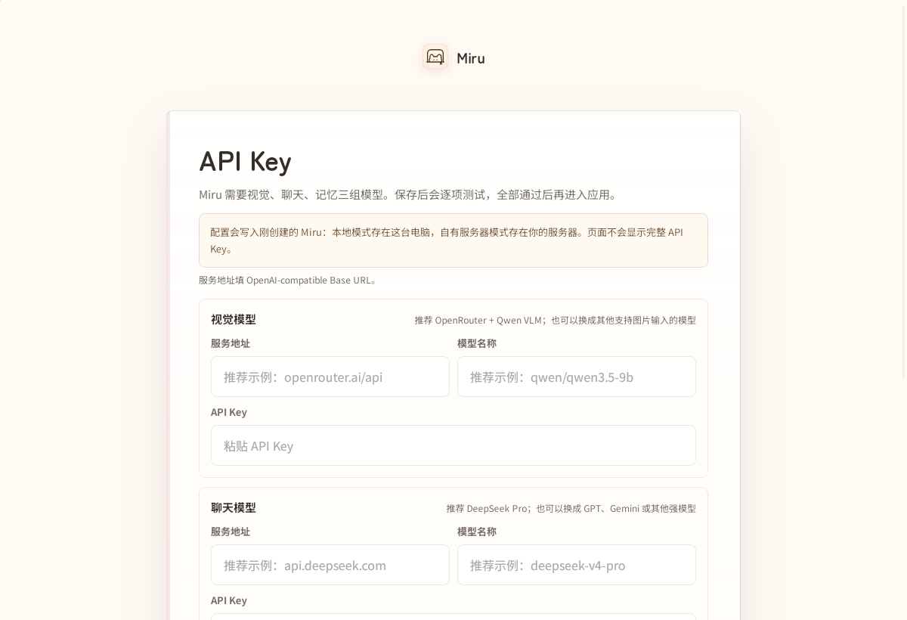
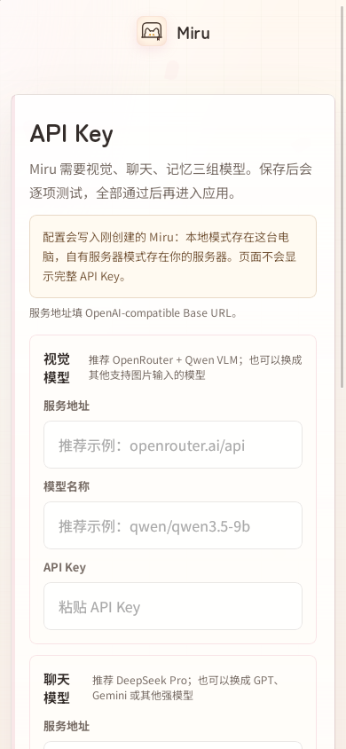
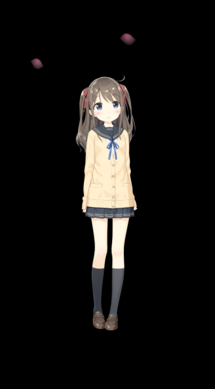

# Ubuntu desktop preview

This source-only preview supports Ubuntu 22.04 x86-64 in an **X11 / Ubuntu on
Xorg** session. It provides the main window, transparent desktop pet, dragging,
resizing, input passthrough, and a global hide/show shortcut. Wayland is rejected
at startup because screen capture and global input support are not implemented.

## Install and run

Use Ubuntu's Python 3.10 with the system GTK packages:

```bash
sudo apt-get install python3-venv python3-gi python3-gi-cairo \
  gir1.2-gtk-3.0 gir1.2-webkit2-4.1 libxcb-cursor0
python3 -m venv --system-site-packages .venv
.venv/bin/python -s -m pip install -r requirements-linux.txt
bash scripts/install_linux_desktop.sh
.venv/bin/python -s linux_launcher.py
```

Run the launcher inside a graphical desktop session. A normal SSH shell has no
display and cannot open the application. The installer creates a **Miru (Ubuntu
preview)** application-menu entry for this checkout; moving the checkout requires
running the installer again. `XDG_DATA_HOME` is respected.
The menu installer rejects checkout paths containing `%`; direct source launch
remains available for those paths. `-s` prevents unrelated user-site packages
from masking missing dependencies; the venv still uses Ubuntu's system GTK.

The pet requires the separately obtained Live2D files listed in
[BUILDING.md](BUILDING.md#third-party-live2d-files) and
[THIRD_PARTY_NOTICES.md](../THIRD_PARTY_NOTICES.md). Those files are not included
in this contribution. No Tauri/Rust compilation is needed for this Linux path;
an installer package is not provided.

Use the existing setup screen for local single-device mode or a private server.
Screen observation stays off until explicitly enabled with the capture test.
Closing the main window shuts down its local runtime and pet; minimizing keeps
them running. The default pet shortcut is `Ctrl+Alt+M`.

## Runtime and data

`linux_launcher.py` reuses the desktop lifecycle in `windows_launcher.py` with a
GTK/WebKit main window. The Linux pet runs in a separate pywebview/Qt WebEngine
process using PySide6 and the existing `pet.html`. Xlib provides input regions,
pointer coordinates and the global shortcut. The Linux renderer disables GPU
compositing to avoid an observed NVIDIA DMA-BUF import failure while retaining
WebGL. Other GPU and display configurations need further coverage.

Data lives under `${XDG_DATA_HOME:-~/.local/share}/Miru`: `config.json`, `data/`,
`logs/miru.log`, `webview/`, and `pet-webview/`. Do not commit any runtime data,
model credentials, invitation codes, or browser profiles.

## Validation

```bash
PYTHONPATH=. .venv/bin/python -s -m pytest tests/ -q
bash scripts/scan_secrets.sh
sudo apt-get install xvfb
xvfb-run -a -s '-screen 0 1440x1000x24' \
  .venv/bin/python -s scripts/smoke_linux_qt_pet.py
```

The smoke check uses an isolated local test page and temporary profile. It does
not need an account, model key, running Miru server, or Live2D redistribution. It
checks the JavaScript bridge, cursor events, window movement/resizing, input
passthrough, and the X11 shortcut. It uses software rendering only in that test
process. Loading a real Live2D model and inspecting transparent animation on a
composited desktop remain separate manual checks.

## Review screenshots

The account-free setup page in GTK at desktop and narrow viewports:




The Qt pet on the isolated X11 test display, using locally obtained sample
assets (the model files themselves are not distributed):


